<div align="center">


[](https://git.io/typing-svg)

<br/>

[](https://pragya-iq.streamlit.app)
[](https://github.com/Avinash9939)
[](https://www.linkedin.com/in/avinashverma108/)
[](https://avinash9939-bzbqqhpyclre4ch66wujwh.streamlit.app)
[](mailto:expert@example.com)

<br/>
<br>


<br/>

PRAGYA IQ is an enterprise-grade, AI-powered Business Intelligence platform designed to transform raw datasets into actionable intelligence. By seamlessly combining data engineering, interactive analytics, machine learning, explainable AI, and automated executive reporting, the platform delivers a unified, high-performance decision intelligence solution for modern organizations.

<br>


<br><br>


</div>

---


## Executive Summary

> *Transforming raw enterprise data into continuous, AI-powered decision support.*

Modern enterprises generate vast quantities of data but frequently lack the technical resources to extract actionable
insights, creating a persistent gap between data collection and strategic execution.

**PRAGYA IQ** bridges this gap as an enterprise-grade, AI-powered Business Intelligence platform designed to transform
raw datasets into actionable intelligence. By automating the entire analytics lifecycle—encompassing data profiling,
cleaning, advanced visualization, and machine learning predictions—the platform enables leaders to execute faster, more
efficient analysis.

Built on a robust, scalable architecture utilizing **FastAPI**, **PostgreSQL**, and **Streamlit**, PRAGYA IQ integrates
**Google Gemini** and **Scikit-Learn** to eliminate traditional data preparation bottlenecks. The system provisions
interactive KPI dashboards, AI-generated business insights, predictive modeling, and transparent model explanations via
**SHAP**.

By reducing manual effort and abstracting the complexity of advanced analytics, PRAGYA IQ empowers organizations to
accelerate data-driven decision-making. This approach improves operational efficiency and effectively transitions static
business data into a proactive, continuous decision support system.

---

## Problem Statement

Modern organizations operate in dynamic business environments where massive volumes of data are continuously generated
across sales, finance, operations, customers, and marketing channels. While this data holds immense strategic value, it
frequently remains disorganized and underutilized because traditional analytics workflows are highly fragmented and
resource-intensive. Consequently, business leaders struggle to extract timely, unified intelligence from their growing
data repositories.

Organizations currently face several critical challenges:

- **Fragmented Analytical Workflows:** Business data must continuously transition through multiple disconnected systems
for extraction, automated cleaning, visualization, and statistical modeling, which results in operational inefficiencies
and isolated data silos.
- **High Technical Dependency:** Routine data analysis and complex predictive modeling require specialized data
engineering and data science expertise, creating substantial resource bottlenecks for non-technical stakeholders.
- **Manual Data Preparation:** A significant portion of time is consumed by manually consolidating, structuring, and
profiling raw datasets before any meaningful business analysis can actually begin.
- **Delayed Decision-Making:** The protracted lifecycle from initial data collection to actionable insight generation
delays strategic execution, preventing organizations from responding agilely to market shifts or operational anomalies.

These challenges highlight the need for an integrated, AI-powered Business Intelligence platform capable of automating
the complete analytics lifecycle.

---

## Solution Overview

PRAGYA IQ fundamentally re-architects how modern enterprises process and evaluate their operational data. By
systematically integrating essential data engineering workflows, qualitative visualization, and artificial intelligence
into a single platform, the solution eliminates the inefficiencies associated with fragmented analytics silos. The
system provisions an end-to-end, automated processing pipeline designed to seamlessly transition raw organizational
information into structured intelligence.

```text
     Secure User Authentication
                  ↓
           Dataset Upload
                  ↓
         Smart Data Cleaning
                  ↓
 Data Profiling & Quality Assessment
                  ↓
        Interactive Analytics
                  ↓
      KPI Dashboard Generation
                  ↓
         Data Visualization
                  ↓
        AI Business Insights
                  ↓
     Machine Learning Prediction
                  ↓
         SHAP Explainability
                  ↓
 Professional PDF Report Generation
```

This structured analytics pipeline automates the standard data lifecycle, ensuring that incoming business data is
systematically processed, rigorously validated, and immediately available for complex analysis. By sequentially linking
intelligent data cleaning heuristics with predictive modeling and generative AI, the platform removes technical barriers
and accelerates routine analytical operations. Rather than navigating disparate tools, users maintain a continuous line
of sight from initial data ingestion to comprehensive reporting. Ultimately, this technical architecture empowers
business stakeholders to rapidly transition from interpreting raw datasets to executing confident, data-driven decision-
making across the enterprise.

---

## Key Features

PRAGYA IQ offers a comprehensive suite of analytical capabilities designed to streamline business intelligence
operations. Each feature is meticulously engineered to minimize manual data processing while maximizing strategic
insight generation and decision-making accuracy.

| Feature | Description |
|---------|-------------|
| **Secure JWT Authentication** | Provides robust user credential management and session validation to ensure enterprise data security. |
| **Dataset Upload & Management** | Enables centralized ingestion and structured organization of raw business data for continuous availability. |
| **Smart Data Cleaning** | Automatically resolves missing values and inconsistencies, accelerating the preparation of data for reliable analysis. |
| **Data Profiling & Quality Assessment** | Generates detailed data health summaries and statistical baselines to validate dataset integrity. |
| **Interactive Analytics** | Allows users to dynamically query and filter datasets to uncover underlying operational trends. |
| **Executive KPI Dashboard** | Synthesizes critical performance indicators into a unified, high-level business overview for strategic monitoring. |
| **Interactive Data Visualization** | Generates sophisticated, dynamic charts for intuitive interpretation of complex business metrics. |
| **AI Business Insights** | Leverages advanced generative AI to formulate contextual narratives and advisory strategies directly from data. |
| **Machine Learning Prediction** | Conducts automated statistical forecasting and anomaly detection to accurately anticipate future market behaviors. |
| **SHAP Explainability** | Provides transparent, feature-level interpretations of predictive model decisions to maintain trust and compliance. |
| **PDF Report Generation** | Exports comprehensive, professional document summaries for seamless executive distribution and review. |
| **REST API** | Facilitates programmatic system connectivity, allowing external enterprise applications to integrate intelligent analytics. |
| **Docker Deployment** | Ensures consistent, scalable, and fully isolated operational execution across any enterprise infrastructure environment. |

---

## System Architecture

PRAGYA IQ is built upon a highly scalable, modular architecture designed to cleanly separate concerns across
presentation, business logic, and data persistence. By implementing the Repository Pattern and Service Layer within a
decoupled backend, the platform ensures long-term maintainability, testability, and seamless integration of complex AI
sub-engines.

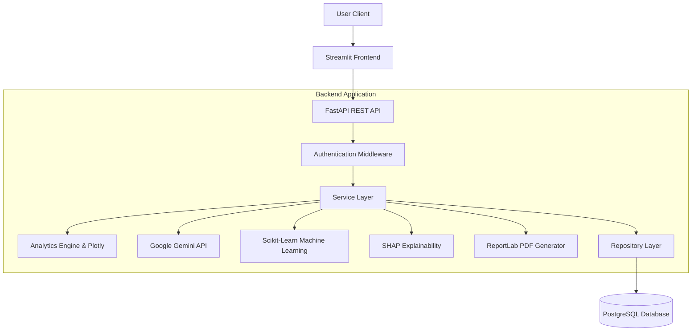

- **Frontend Layer (Streamlit):** Serves as the interactive user interface, rendering complex visualizations and
dashboards directly in the browser while maintaining a lightweight footprint.
- **API Layer (FastAPI):** Controls all HTTP traffic, routing structured REST requests, validating inputs, and enforcing
robust JWT-based security middleware protocols.
- **Service Layer:** Organizes core business operations. It coordinates data processing workflows and actively manages
communication between the analytics engine, predictive models, and Google Gemini capabilities.
- **Specialized Engines:** Independent sub-modules tightly orchestrated by the service layer, including SHAP for
transparent model explainability, Plotly for dynamic qualitative rendering, and ReportLab for PDF generation.
- **Repository Layer:** Abstracted data access tier that standardizes all entity interactions and completely isolates
the database from underlying business logic.
- **Data Persistence (PostgreSQL):** Robust relational database responsible for securely storing configuration states,
uploaded datasets, encrypted user profiles, and persistent organizational analytics.

---

## AI Pipeline

The PRAGYA IQ AI Pipeline represents a fully automated, continuous data lifecycle designed to convert raw operational
data into actionable strategic insights. By executing sequential, intelligent transformations, the pipeline ensures
rigorous data integrity throughout complex predictive modeling and generative advisory phases.

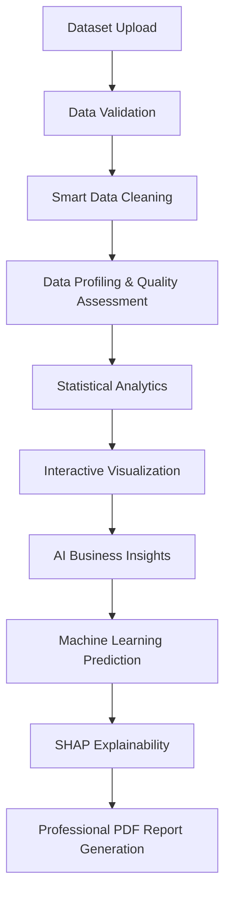

- **Dataset Upload & Validation:** Securely ingests raw organizational data and automatically validates schema
structures against enterprise baselines to prevent corruption.
- **Smart Data Cleaning:** Algorithmically resolves missing values, eliminates duplicates, and standardizes formats to
establish a reliable foundation for statistical analysis.
- **Profiling & Analytics:** Executes comprehensive qualitative assessments to isolate trends, subsequently establishing
statistical baselines via the core analytics engine.
- **Interactive Visualization:** Dynamically renders the processed metrics into an accessible, interactive graphical
dashboard.
- **AI Business Insights:** Feeds structured metrics into Google Gemini to synthesize high-level contextual narratives
and actionable business advisories.
- **Machine Learning & Explainability:** Deploys adaptive Scikit-Learn models to forecast future trends, utilizing SHAP
to provide complete transparency into the algorithmic decision-making process.
- **Reporting:** Asynchronously compiles all localized insights, visualizations, and explainable models into a
professional PDF document for executive distribution.

---

## Project Structure

PRAGYA IQ follows a highly modular, decoupled architecture establishing a strict separation of concerns between
presentation, business logic, and data persistence. This organizational structure promotes long-term scalability,
testability, and isolated deployment workflows across enterprise environments.

```text
PRAGYA-IQ/
├── backend/
│   ├── app/
│   │   ├── api/
│   │   ├── core/
│   │   ├── models/
│   │   ├── repositories/
│   │   ├── services/
│   │   ├── schemas/
│   │   ├── utils/
│   │   └── main.py
│   ├── uploads/
│   └── requirements.txt
│
├── frontend/
│   ├── assets/
│   ├── components/
│   ├── services/
│   ├── utils/
│   ├── views/
│   └── app.py
│
├── screenshots/
├── reports/
├── docker-compose.yml
├── README.md
└── LICENSE
```

| Directory | Purpose |
|-----------|---------|
| `backend/` | Source code for the FastAPI server, database integrations, and core intelligence APIs. |
| `frontend/` | Source code for the interactive Streamlit user interface and data visualization components. |
| `services/` | Contains isolated business logic, machine learning pipelines, and Google Gemini integrations. |
| `repositories/` | Implements the Repository Pattern for abstracted, secure PostgreSQL data access. |
| `models/` & `schemas/` | Defines ORM database models and Pydantic validation schemas. |
| `uploads/` | Secure, localized temporal storage directory for ingested organizational datasets. |
| `reports/` | Output directory containing generated professional PDF analysis reports. |

---

## Modules

### Login

The PRAGYA IQ platform secures organizational data access through a robust, enterprise-grade authentication module. By
leveraging advanced JWT (JSON Web Token) authentication, the system ensures that user sessions are rigorously validated
and securely managed without relying on persistent server-side states. This maintains strict access controls while
delivering a seamless, highly responsive login experience.

<p align="center">
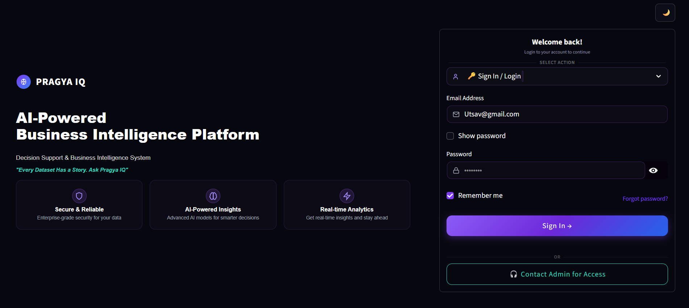
</p>

---

### Upload Data

The Upload Data module operates as the foundational entry point for the entire PRAGYA IQ analytics pipeline. It provides
a secure, intuitive interface for stakeholders to directly ingest raw organizational data into the system. Once
authenticated, users can effortlessly upload business datasets, establishing the primary data source for all subsequent
operations.

Upon successful ingestion, these uploaded datasets transition into the automated processing pipeline. The system
systematically prepares this raw information to power the downstream data lifecycle, including intelligent qualitative
profiling, interactive KPI dashboard generation, generative AI business insights, and advanced machine learning
predictions. By securely centralizing data ingestion, this centralized interface ensures a reliable and seamless
transition from static files to continuous, data-driven decision-making.

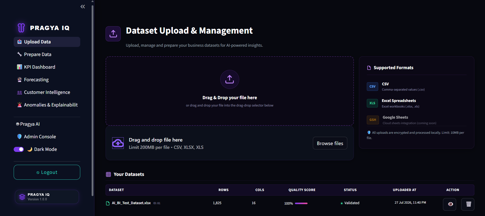

---

### Prepare Data

The Prepare Data module functions as the critical processing bridge between raw ingestion and advanced analytical
modeling. It provides an intuitive interface for stakeholders to execute comprehensive data cleaning and structured
quality assessments before proceeding with downstream analysis.

This module systematically evaluates incoming datasets to identify operational anomalies, duplicate records, and missing
values. Users can instantly execute automated deduplication routines and contextual missing-value imputation.
Furthermore, it establishes foundational statistical baselines and verifies exact schema integrity to ensure that all
subsequent machine learning predictions and AI-driven business insights are derived from thoroughly validated, high-
fidelity information schemas. By fully centralizing these vital preparation workflows, the interface eliminates complex
manual restructuring, guaranteeing robust data reliability.

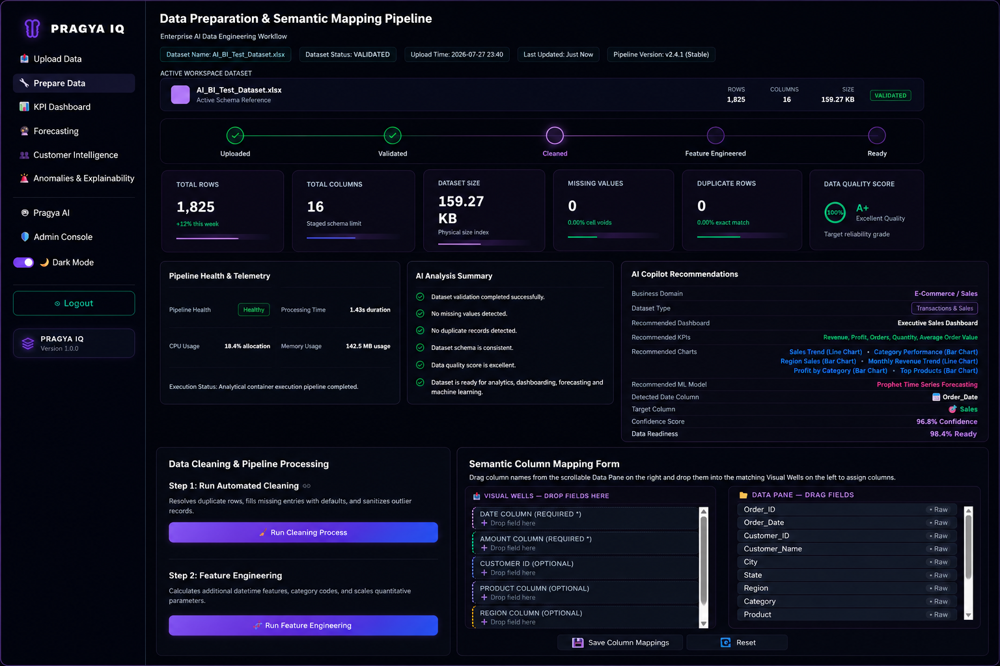

---

### KPI Dashboard

The KPI Dashboard serves as the central command center for executive business monitoring, transforming processed
datasets into dynamic, real-time visual intelligence. This module empowers continuous operational oversight by
presenting highly customizable metrics, allowing stakeholders to rapidly interpret complex business performance through
an intuitive interface.

The interface prominently features high-level KPI cards that deliver immediate visibility into fundamental
organizational targets. Users can fluidly interact with sophisticated charts and granular filtering mechanisms to
isolate specific temporal trends, operational segments, or geographical performance data. This interactive capability
facilitates deep-dive trend analysis, ensuring that underlying anomalies and growth trajectories are immediately evident
without requiring technical queries.

By systematically centralizing disparate data streams into a cohesive visual format, the dashboard accelerates strategic
situational awareness. It eliminates the friction typically associated with manual reporting, delivering robust decision
support capabilities that enable enterprise leaders to proactively pivot business strategies based on verified, real-
time analytical evidence.

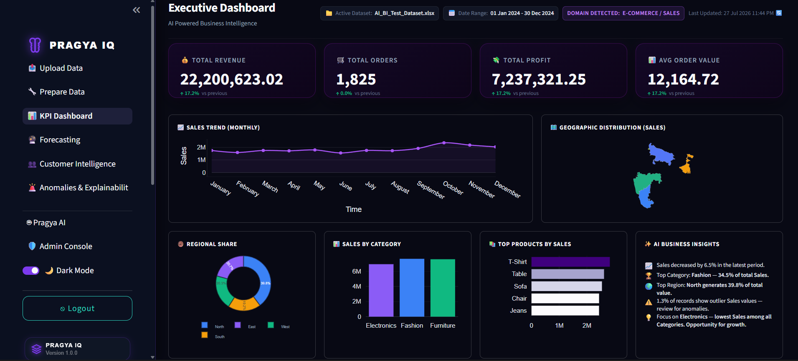

---

### Forecasting

The Forecasting module transitions standard business intelligence from reactive observation to proactive, predictive
planning. It systematically transforms historical organizational data into precise future insights by leveraging
automated machine learning algorithms. This capability allows stakeholders to anticipate market shifts, operational
demands, and financial trajectories with high statistical reliability.

The interface centers on dynamic forecast charts that visualize both historical patterns and predicted future values
across customizable time horizons. These visual models are augmented with clearly defined confidence intervals,
providing executives with an exact measure of predictive certainty to support risk-adjusted decision-making. Users can
directly manipulate forecasting controls to adjust simulation parameters, instantaneously recalculating trend analysis
models and projected outcomes.

Furthermore, the module explicitly details underlying model performance metrics, ensuring complete transparency
regarding algorithmic accuracy. By bridging advanced statistical modeling with an intuitive visualization interface, the
Forecasting module empowers organizations to execute strategic resource allocation, optimize supply chains, and mitigate
emerging business risks long before they materialize.

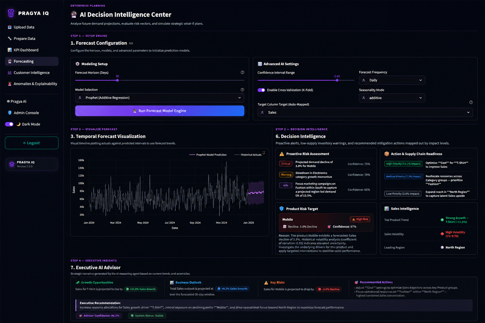

---

### Customer Intelligence

The Customer Intelligence module centralizes the analytical interpretation of client behavior, transforming scattered
transactional records into cohesive, strategic segmentation profiles. This robust interface provides organizations with
a deep, multidimensional understanding of purchasing patterns and demographic intelligence, completely automating the
extraction of vital consumer metrics.

The dashboard visually isolates critical customer KPIs through interactive segmentation charts and granular cohort
analytics. By executing sophisticated RFM (Recency, Frequency, Monetary) analysis alongside dynamic retention metrics,
the module surfaces exact profiles of high-value segments versus those displaying critical churn indicators. Users can
continuously monitor shifting lifetime value projections, effortlessly isolating the behavioral drivers that directly
influence organizational revenue.

By structurally correlating previously disparate customer interactions into a unified visual narrative, this module
provides executives with essential operational clarity. These comprehensive insights fundamentally support proactive,
data-driven business decisions—empowering organizations to deploy targeted engagement strategies, optimize resource
allocation, and systematically maximize overall client retention and satisfaction.

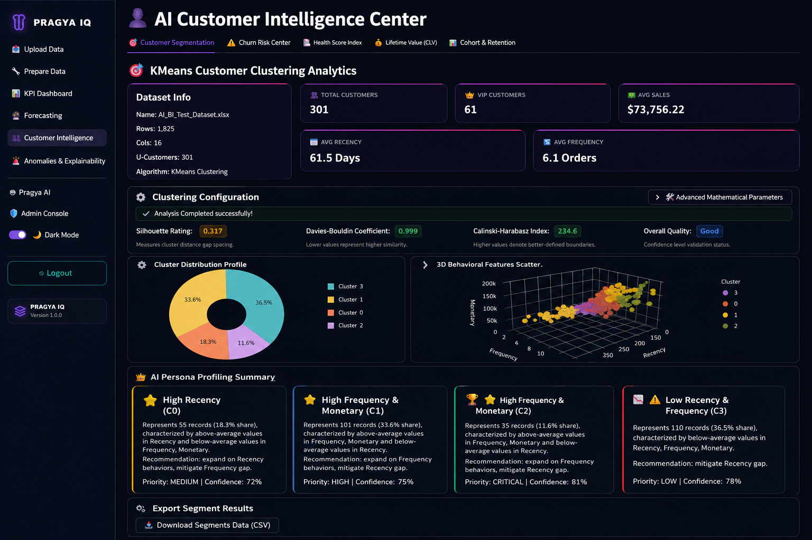

---

### Churn Risk Center

The Churn Risk Center provides advanced predictive intelligence to proactively identify and mitigate customer attrition.
By deploying robust machine learning models, the module evaluates historical behavioral patterns to accurately forecast
future churn probabilities. The system presents comprehensive model performance evaluations, utilizing predictive
metrics and an interactive ROC curve to ensure statistical reliability. Furthermore, the interface features dynamic
feature importance visualization alongside transparent SHAP-based reasoning, allowing stakeholders to precisely
understand the essential risk drivers for specific customer segments. Beyond identifying at-risk accounts, the Churn
Risk Center continuously translates complex predictive outputs into intuitive risk assessments and targeted business
action recommendations. This explainable AI approach guarantees complete transparency within algorithmic decision-making
processes, thereby empowering enterprise leaders to execute highly effective, data-driven retention strategies and
systematically optimize long-term customer lifetime value.

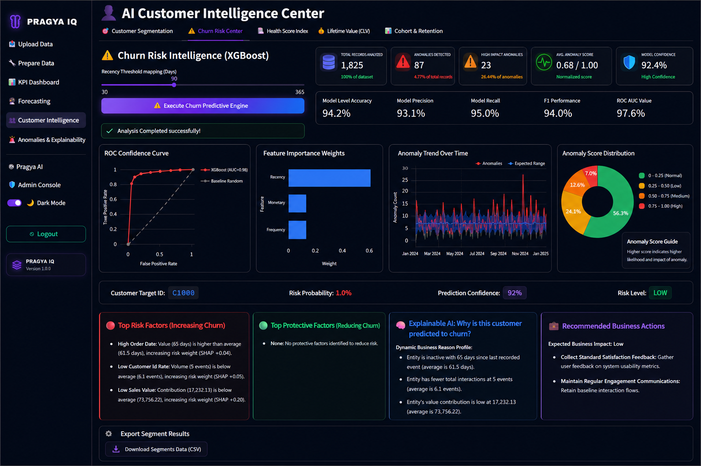

---

### Health Score Index

The Health Score Index provides a comprehensive evaluation of overall customer vitality by synthesizing complex
behavioral metrics and AI-driven analytics. Moving beyond isolated data points, the system executes real-time risk
assessments to categorize the client base into healthy, caution, and at-risk segments, clearly visualized through an
intuitive histogram distribution analysis. The interface features a precise aggregated customer health score alongside
actionable, AI-generated health insights, allowing stakeholders to rapidly interpret underlying engagement trends. By
translating these analytical outputs into a strategic recommendation matrix, the module empowers organizations to
execute highly targeted intervention campaigns. This proactive diagnostic approach enables enterprise leaders to shift
from reactive troubleshooting to structured retention planning, ultimately bridging intelligence with customer success
strategies and systematically maximizing long-term portfolio value.

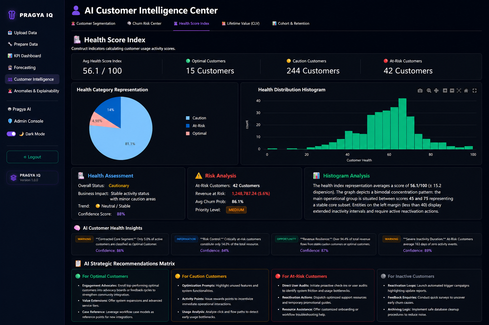

---

### Customer Lifetime Value (CLV)

The Customer Lifetime Value (CLV) section precisely estimates future customer profitability by synthesizing AI-driven
revenue projections with dynamic customer segmentation. Utilizing interactive revenue projection controls, the executive
dashboard explicitly visualizes lifetime revenue segments and comprehensive revenue distribution, ensuring stakeholders
maintain deep visibility into cohort performance. The integrated AI-powered recommendation engine simultaneously
evaluates these distributions to automatically surface and rank projected high-value customers. By structurally
isolating these premier clients, the module empowers organizations to accurately estimate future revenue potential and
prioritize critical retention investments. This intelligence enables enterprise leaders to shift away from broad
marketing initiatives toward optimized, data-backed customer expansion strategies. Ultimately, bridging these
sophisticated financial projections with actionable insights solidifies executive decision support, systematically
maximizing long-term business growth and optimizing resource allocation across all client engagement lifecycles.

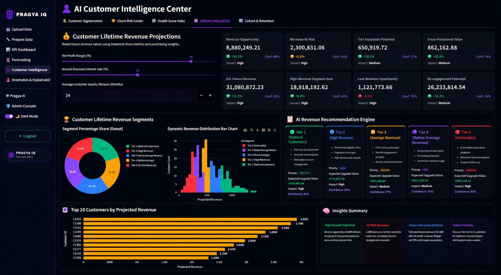

---

### Cohort & Retention Analysis

The Cohort & Retention Analysis section rigorously evaluates structural customer loyalty by tracking long-term
engagement trends through localized, time-based segmentations. Utilizing an interactive cohort retention matrix, the
module systematically isolates specific retention KPIs alongside overarching churn progression across distinct
acquisition groups. By correlating temporal engagement analysis with broader customer retention trends, organizations
can transparently visualize exactly when distinct cohorts decline or stabilize throughout their lifecycle. The
integrated AI-generated retention insights automatically interpret these complex behavioral matrices, identifying the
underlying operational factors that trigger attrition. This continuous intelligence empowers enterprise leaders to
rapidly act upon immediate retention opportunities and proactively restructure customer lifecycle management. By
shifting from generalized engagement metrics to targeted cohort comparison, organizations can accurately diagnose
problematic onboarding cycles and continually optimize highly effective, long-term retention strategies with empirical
precision.

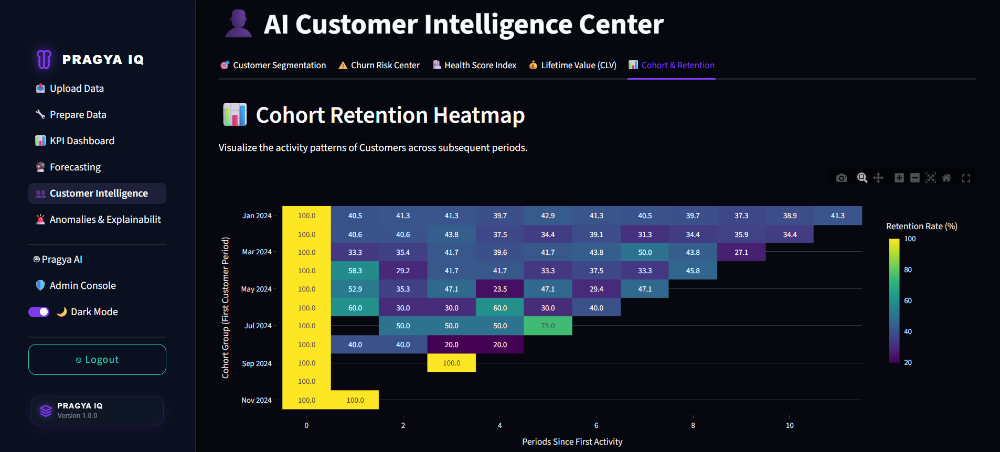

---

### Anomalies & Explainability

The Anomalies & Explainability module serves as a critical diagnostic engine, continuously detecting abnormal business
patterns through advanced AI-driven anomaly detection and explainable AI techniques. By utilizing an intuitive anomaly
detection configuration, the system isolates irregular transactions and operational deviations within the broader
dataset. The executive KPI diagnostics provide immediate contextual assessment of these irregularities, which are
further clarified through precise anomaly visualization. Rather than delivering black-box alerts, the module employs
robust SHAP explainability and targeted root cause analysis to transparently reveal the distinct factors contributing to
each anomaly. An integrated anomaly confidence assessment structurally evaluates the severity of these irregular events,
immediately supported by AI-generated business recommendations for mitigation. These deep diagnostic capabilities
empower organizations to rapidly identify and investigate abnormal transactions, significantly reduce unmitigated
operational risk, and provide executive stakeholders with the transparent intelligence required for faster, precisely
targeted decision-making.

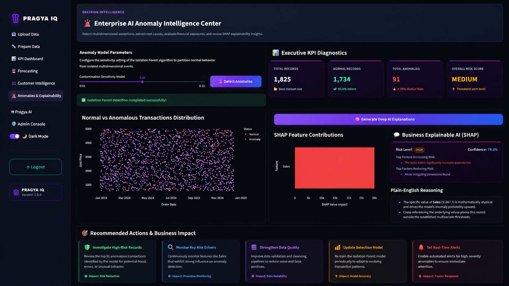

---

### Pragya AI

The Pragya AI module operates as an advanced conversational business intelligence assistant, empowering executives to
interact directly with complex enterprise data using intuitive natural language. Featuring a streamlined AI chat
interface alongside guided business query suggestions, the system seamlessly translates conversational questions into
highly actionable analytical responses. Without requiring manual navigation through disparate dashboards, stakeholders
can instantly retrieve exact revenue metrics, identify top-performing customer segments, and visualize regional
performance trends through dynamically generated chart-based visualizations. The assistant structurally supports these
outputs with transparent confidence indicators, ensuring that every AI-generated business insight remains fully grounded
in verified organizational data. By completely abstracting the technical barriers associated with traditional data
querying, this module simplifies enterprise self-service analytics and dramatically accelerates executive reporting
workflows. Ultimately, Pragya AI drives a proactive data culture, significantly improving data accessibility across the
organization and providing business users with the immediate, frictionless decision support required to execute vital
strategic operations.

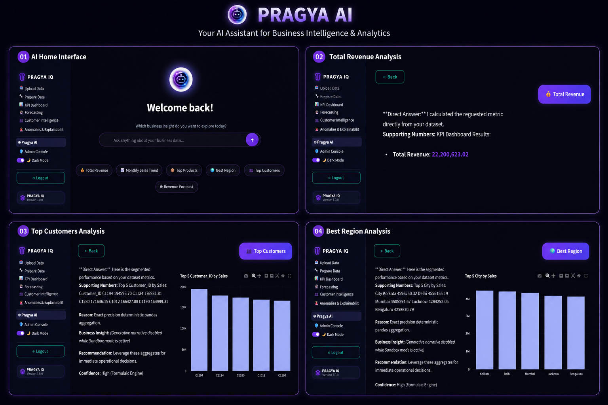

---

## API Documentation

PRAGYA IQ features a robust, secure, and fully decoupled REST API built on **FastAPI**. The API layer serves as the
central nervous system of the platform, orchestrating all incoming requests, enforcing JWT-based authentication, and
securely dispatching business logic to analytical engines and AI models. This decoupled architecture allows enterprise
clients to programmatically integrate PRAGYA IQ's intelligence into external business workflows seamlessly.

### Authentication

The authentication module secures access to the platform and individual datasets by enforcing role-based permissions and
stateless JWT session management.

| Method | Endpoint | Description |
|---------|----------|-------------|
| `POST` | `/api/v1/auth/register` | Registers a new user into the platform and encrypts credentials. |
| `POST` | `/api/v1/auth/login` | Authenticates a user and issues a secure JWT access token. |

### Dataset Management

Manages the core data ingestion lifecycle, securely handling file uploads, persistent storage operations, configuration,
and retrieval.

| Method | Endpoint | Description |
|---------|----------|-------------|
| `POST` | `/api/v1/datasets/upload` | Securely ingests and registers new organizational tabular data. |
| `GET` | `/api/v1/datasets` | Retrieves a paginated list of all active datasets accessible to the user. |
| `GET` | `/api/v1/datasets/{id}` | Retrieves detailed metadata and schema information for a specific dataset. |
| `PUT` | `/api/v1/datasets/{id}/mapping` | Updates logical column mappings (e.g., Target, Date) for AI processing. |
| `DELETE`| `/api/v1/datasets/{id}` | Permanently deletes a dataset and its associated analytical artifacts. |
| `POST` | `/api/v1/datasets/{id}/index` | Vectorizes the dataset schema and statistics for RAG-based AI queries. |

### Data Preparation

Automates critical data engineering steps by programmatically identifying inconsistencies, generating statistical
features, and imputing missing variables.

| Method | Endpoint | Description |
|---------|----------|-------------|
| `POST` | `/api/v1/datasets/{id}/clean` | Automatically resolves missing values, eliminates duplicates, and standardizes formats. |
| `POST` | `/api/v1/datasets/{id}/engineer-features` | Synthesizes new analytical attributes derived from temporal or categorical data. |

### KPI Dashboard

Retrieves aggregated, high-level business metrics necessary for rendering interactive executive dashboards and
visualizing operational health.

| Method | Endpoint | Description |
|---------|----------|-------------|
| `GET` | `/api/v1/kpi/{dataset_id}/sales` | Retrieves aggregated revenue, transaction volume, and overall sales metrics. |
| `GET` | `/api/v1/kpi/{dataset_id}/customer` | Computes customer-centric metrics including acquisition numbers and overarching engagement. |
| `GET` | `/api/v1/kpi/{dataset_id}/product` | Extracts top-performing product lines and overall inventory velocity metrics. |
| `GET` | `/api/v1/kpi/{dataset_id}/region` | Retrieves geographic performance distributions and regional sales analytics. |

### AI Predictive Modeling

Exposes advanced machine learning workflows to dynamically calculate forecasts, identify anomalies, and evaluate complex
client retention scenarios.

| Method | Endpoint | Description |
|---------|----------|-------------|
| `POST` | `/api/v1/ml/{dataset_id}/forecast` | Executes time-series forecasting to predict future operational or financial metrics. |
| `POST` | `/api/v1/ml/{dataset_id}/segment` | Categorizes customers into strategic cohorts using underlying behavioral data (e.g., RFM). |
| `POST` | `/api/v1/ml/{dataset_id}/churn` | Calculates complex churn probabilities for active clients to identify at-risk accounts. |
| `POST` | `/api/v1/ml/{dataset_id}/anomaly` | Implements anomaly detection algorithms to flag abnormal operational shifts or transactions. |

### Explainable AI (SHAP)

Delivers transparent insight into predictive model logic by quantifying exactly which variables influenced a given
algorithmic prediction.

| Method | Endpoint | Description |
|---------|----------|-------------|
| `GET` | `/api/v1/ml/{ml_run_id}/shap/{entity_ref}` | Retrieves exact feature importance values mapping how a specific prediction was derived. |

### Pragya AI Assistant & AI Insights

Provides LLM-driven inference endpoints capable of answering natural language queries, generating strategic business
summaries, and assessing dashboard intelligence.

| Method | Endpoint | Description |
|---------|----------|-------------|
| `POST` | `/api/v1/ai/{dataset_id}/chat` | Solves natural language questions by querying embedded dataset context (RAG). |
| `GET` | `/api/v1/ai/{dataset_id}/chat/{session_id}/history` | Retrieves historical conversation artifacts associated with a specialized AI session. |
| `GET` | `/api/v1/ai/{dataset_id}/recommendations` | Computes and returns grounded, AI-derived business optimization strategies. |
| `GET` | `/api/v1/ai/{dataset_id}/executive-summary` | Generates a comprehensive, human-readable narrative summarizing overall dataset health. |
| `POST` | `/api/v1/ai/{dataset_id}/performance-intelligence/explain` | Analyzes flagged anomalies or variance to instantly explain underlying business contexts. |

### Report Generation & Export Services

Facilitates the formal structuring and external dissemination of analytical insights via programmatic PDF compilation
and file streams.

| Method | Endpoint | Description |
|---------|----------|-------------|
| `POST` | `/api/v1/reports/{dataset_id}/generate` | Compiles a professional, localized PDF report containing data visualizations and LLM summaries. |
| `GET` | `/api/v1/reports/{id}/download` | Executes a secure, streamlined filestream download of the requested executive report. |

***

*By seamlessly weaving data pipeline logic, advanced qualitative rendering (Plotly), and machine learning (Scikit-
Learn/SHAP) alongside generative AI (Google Gemini via RAG) into a single, cohesive REST architecture, PRAGYA IQ
fundamentally accelerates time-to-insight. Every isolated workflow endpoint feeds directly into a continuous lifecycle,
ultimately ensuring organizations can instantly access, understand, and strategically act on their internal data through
end-to-end processing execution.*

---

## Technology Stack

PRAGYA IQ is built upon a modern, highly decoupled technology stack designed specifically for enterprise-grade
Artificial Intelligence, Machine Learning, and Business Intelligence applications.

| Category | Technology | Purpose |
|----------|------------|---------|
| **Programming Language** | Python | Core backend logic, multi-engine data processing, and analytical service scripting. |
| **Frontend Framework** | Streamlit | Rapid rendering of interactive UI components, KPI dashboards, and data visualization. |
| **Backend API Framework** | FastAPI | High-performance, asynchronous REST API orchestration and client-server routing. |
| **Database & ORM** | PostgreSQL & SQLAlchemy | Robust enterprise data persistence, relationship modeling, and isolated state management. |
| **Generative AI** | Google Gemini | Large Language Model (LLM) powering conversational analytics and business summarization. |
| **AI Orchestration** | LangChain & FAISS | Context retrieval (RAG), text embedding, and semantic vector indexing for AI queries. |
| **Machine Learning** | Scikit-Learn | Core library executing regression algorithms, segmentation, and continuous predictive modeling. |
| **Explainable AI (XAI)** | SHAP | Generates transparent feature-level diagnostic reasoning for opaque machine learning predictions. |
| **Data Processing** | Pandas & NumPy | High-speed tabular manipulation, automated data cleaning, and statistical calculations. |
| **Data Visualization** | Plotly | Renders highly interactive, complex graphical charts for quantitative performance insights. |
| **Security & Auth** | JSON Web Tokens (JWT) | Ensures secure, stateless user session validations and role-based access control. |
| **Reporting Engine** | ReportLab | Programmatic compilation and asynchronous generation of structured executive PDF reports. |
| **Deployment** | Docker & Docker Compose | Containerizes independent application services to guarantee isolated, scalable pipeline deployment. |

By synergizing scalable data engineering (Pandas, PostgreSQL) with bleeding-edge AI frameworks (Gemini, Scikit-Learn,
SHAP), PRAGYA IQ ensures continuous reliability regardless of enterprise data volume. The containerized FastAPI backend
structurally isolates intensive analytical processing from the interactive Streamlit frontend, while seamless API
integration ensures that every capability—from generative reasoning to predictive modeling—remains fully accessible,
highly secure, and continuously reliable for executive decision support.

---

# Installation

The following steps outline the process for setting up and launching PRAGYA IQ in a local development environment. This
guide assumes you have securely cloned the repository and are utilizing a local Python environment.

---

## Prerequisites

Ensure your local development environment meets the following requirements:
- Python 3.10+
- Git
- PostgreSQL (Local or Cloud instance)
- Anaconda (Recommended for environment management)

*(Note: Ensure all dependencies found in `requirements.txt` are successfully installed within your environment.)*

---

## Clone Repository

Begin by cloning the codebase to your local machine and navigating into the project directory:

```bash
git clone https://github.com/organization/pragya-iq.git
cd PRAGYA-IQ
```

---

## Backend Setup

Navigate to the `backend` directory and start the FastAPI server to initialize the platform's API routing and core
intelligence operations.

```bash
cd backend
python -m uvicorn app.main:app --reload --port 8000
```

*This command starts the robust FastAPI backend architecture, actively running on port **8000**.*

---

## Frontend Setup

In a new independent terminal session, navigate to the `frontend` directory and launch the interactive Streamlit
application.

```bash
cd frontend
streamlit run app.py
```

*This command dynamically initializes the Streamlit frontend UI, running locally on port **8501**. (Note: ensure your
filename matches your exact Streamlit entry point, typically `app.py` or `streamlit_app.py`)*

---

## Access the Application

Once both internal services are successfully running, you can seamlessly access the application through your web
browser:

| Service | URL |
|---------|-----|
| Streamlit UI | [http://localhost:8501](http://localhost:8501) |
| FastAPI API | [http://localhost:8000](http://localhost:8000) |
| Swagger API Docs | [http://localhost:8000/docs](http://localhost:8000/docs) |

---

## Verify Installation

To actively confirm that PRAGYA IQ has started successfully, simply open your browser and navigate to the Streamlit UI at `http://localhost:8501`. If the polished Login interface renders successfully and the Swagger API Docs are fully accessible at `http://localhost:8000/docs`, both the system's backend processing engine and frontend interactive layer are successfully configured and communicating.

---

<div align="center">

## 👨‍💻 Author

**Avinash Verma**
<br>
*AI Engineer | Data Analyst*
<br>
Building scalable, AI-powered Business Intelligence architectures to solve complex enterprise challenges.
<br><br>

<a href="https://github.com/Avinash9939"></a>
<a href="https://www.linkedin.com/in/avinashverma108/"></a>
<a href="#"></a>
<a href="mailto:akkumar1082004@gmail.com"></a>
<a href="#"></a>

<br><br>
---

## About

I specialize in architecting sophisticated enterprise analytics platforms that seamlessly transition stagnant business
data into proactive intelligence. My core expertise bridges the critical gap between complex Artificial
Intelligence—including Machine Learning, Generative AI, and Explainable Data structures—with high-performance Full-Stack
Development frameworks. By synthesizing rigorous Data Science methodologies with robust Business Intelligence workflows,
I successfully build tailored technical solutions that actively empower executive leadership to rapidly execute data-driven 
strategies and maximize long-term operational impact.

<br><br>
---

## 🤝 Open Source

PRAGYA IQ thrives on the collective intelligence and rigorous standards of the open-source community. Technical
contributions from developers, data scientists, AI engineers, and business intelligence professionals are highly
encouraged to continuously elevate the analytics pipeline.

<br>

**<a href="https://github.com/Akash-nath29/Pragya-IQ/issues">Feature Requests</a>** • 
**<a href="https://github.com/Akash-nath29/Pragya-IQ/issues">Bug Reports</a>** • 
**<a href="https://github.com/Akash-nath29/Pragya-IQ/pulls">Pull Requests</a>** • 
**<a href="https://github.com/Akash-nath29/Pragya-IQ/discussions">Discussions</a>**

<br><br>
---

## Support

Technical recognition and collaborative feedback keep this repository continually evolving.
<br>
⭐ **If you found PRAGYA IQ's architecture technically valuable or inspiring, please consider giving this repository a Star.**

</div>

<p align="center">
  <i>"Enterprise intelligence is not measured by the absolute volume of data successfully collected, but precisely by
the velocity at which that raw data is systematically transformed into confident, executable strategy."</i>
</p>

